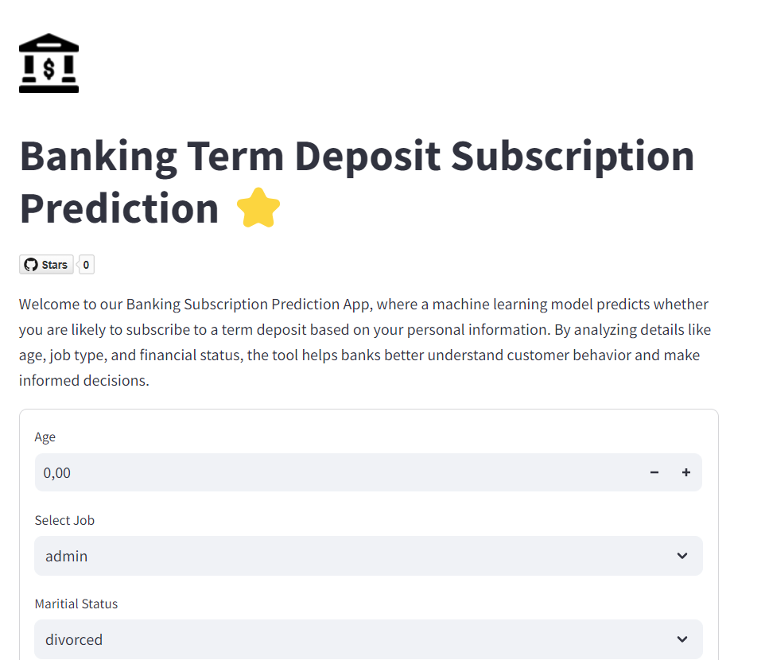
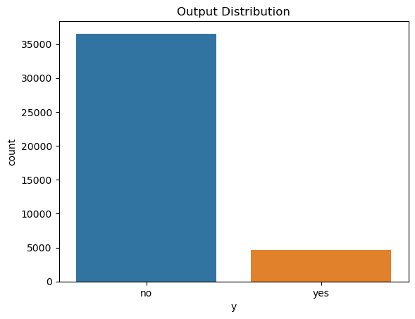
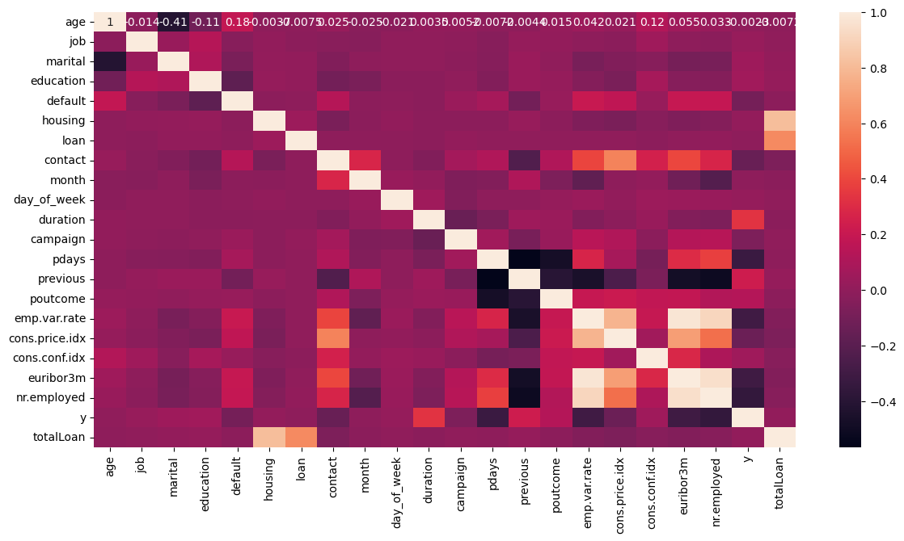
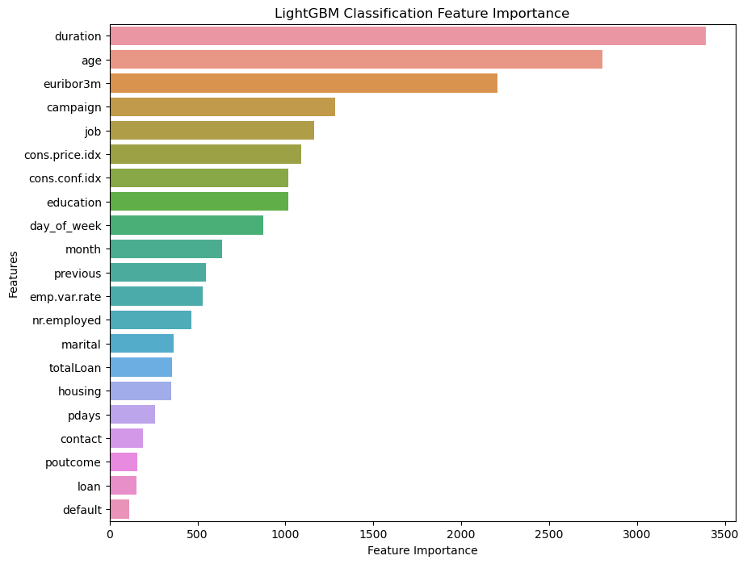

# Banking Classification Project

This project demonstrates the use of machine learning for classifying whether customers will subscribe to a term deposit based on a bank marketing dataset. The project involves data loading, exploration, visualization, feature engineering, model training, and evaluation.


## Table of Contents
1. [Project Overview](#project-overview)
2. [Deployment](#deployment)
3. [Installation](#installation)
4. [Dataset](#dataset)
5. [Exploratory Data Analysis (EDA)](#exploratory-data-analysis-eda)
6. [Preprocessing](#preprocessing)
7. [Model Training](#model-training)
8. [Model Evaluation](#model-evaluation)
9. [Results](#results)
10. [Next Steps](#next-steps)


## Project Overview

This project aims to predict whether a client will subscribe to a term deposit after a bank marketing campaign. The dataset which is located in the file "banking_additional.csv" is obtained from a publicly available source and contains various client-related features such as age, job, marital status, education, and more. The project walks through the data analysis, visualization, and model-building process.



## Deployment

The project is deployed using Streamlit. The running application can be found at the address: https://cnbrkaydemir-banking-classification-streamlit-app-2dki3t.streamlit.app/ 


## Installation

Clone the repository using the command: 

```ruby
git clone https://github.com/cnbrkaydemir/Banking-Classification.git
```

Then download the required libraries using the commands:

```ruby
pip install streamlit
pip install numpy
pip install tensorflow
pip install pandas
```

Finally run the application using the command:

```ruby
streamlit run streamlit_app.py
```

## Dataset 
The dataset has 41188 entries which are collected from 41188 customers. For all of these entries there are 20 columns to represent distinct features of these entries. And there is one final column to represent the target variable.

|Feature | Explanation |
| ---      | ---       |
| Age | The age of the customer represented as float64.|
| Job     | Categorical variable to represent the job of the customer.        |
|Maritial|  Categorical variable with categories married, single and divorced.|
|Education| Level of education the customer has completed encoded categoricly.|
|Default|Whether the credit is in default or not for the customer. (yes/no/unknown)|
|Housing|Does the customer have housing loan ? (yes/no/unknown)|
|Loan|Does the customer have personal loan ? (yes/no/unknown)|
|Contact|The type of contact used to reach the customer, cellular or landline.|  
|Month|The last month the customer was contacted.|
|Day|The day of the week the customer was last contacted.|
|Duration |The duration of the last contact in seconds.|
|Campaign|Number of days that passed by after the client was last contacted from a previous campaign.|
|Pdays|Number of contacts performed before this campaign and for this client.| 
|Previous|Number of days that passed by after the client was last contacted from a previous campaign.|
|Poutcome|Outcome of the previous marketing campaign (failure/success).|
|Emp.var.rate|Employee variance rate for this client.|
|Cons.price.idx|Consumer price index|
|Cons.conf.idx|Consumer confidence index|
|Euribor3m|Euribor 3 month rate|
|NrEmployed|Number of employees|
|y|Did the customer subscribe to the term deposit or not.|
 

## Exploratory Data Analysis (EDA)
The python notebook Banking_Classification.ipynb provides detailed data analysis for all of the collumns. Here we have chosen to preview only the target variable and the correlation matrix.



Target variable is very imbalanced as you can see from the countplot above. For this reason the task will be slightly harder compared to a balanced target variable. Optimizing the precision and recall rates will be extra tricky.




The figure above is the correlation matrix. If we observe the matrix we can infere that duration and age have positive correlation with respect to y. 


## Preprocessing
The preprocessing steps applied are listed bellow:

+ **Dropping Duplicate Entries** : There are multiple duplicate entries we have simply dropped them using pandas functions.
+ **Handling Outliers** : For numeric features we have eliminated outliers by founding the quartiles and calculating inter-quartile range.
+ **Label Encoding on Categorical Features** : Encode the categorical variables using the LabelEncoder class in sklearn library.
+ **Logarithm Transformation on Columns with Skewnness** : Logarithm transformation is known to create a normal distribution from skewed data. The normal distribution may help with better model performance so we have transformed the features with skewness.  
+ **Scaling** : Scaled the feature variables for better model performance.
+ **Oversampling to balance the data using SMOTE** : The target variable is very imbalanced. So we have created new synthetic samples of the minority class using the SMOTE method for improving model performance.

+ **Feature Engineering** : Created an additional feature called "totalLoan" which is the sum of 

## Model Training
For this classification task we have worked with many models ranging from logistic regression to simple neural nets. We wil dive deeper into evaluation metrics later but it should be also noted that accuracy metric is not very significant for the imbalanced data that and therefore this problem requires other metrics to evalute model performances.


Models used for the classification analysis as follows:

+ **Logistic Regression**  
+ **Decision Trees** 
+ **Random Forest**
+ **XGBoost**
+ **LightGbm**
+ **Neural Nets**
 

 ## Model Evaluation
Accuracy or RMSE metrics can be useful if the problem revolved around a balancad dataset or a regression problem but for this dataset that is not the case. For analysing the model performances we will use the two of the most important metrics precision and recall which are somewhat opposite in nature. Considering the trade-off between precision and recall we may optimize one while minimizing the other. The case of low recall translated to our problem is  the action of classifying a customer who will subscribe as negative which is equivalent of losing a real customer whereas the low precision case is the act of suggesting a negative customer entry will subscribe. Models with low recall will cause the bank to lose valuable  customers whereas models with low precision will waste some time of the bank. So for this problem the primary metric that will be used for model evaluation is recall.


|Model|Recall|Precision|Accuracy|
|---|---|---|---|
|Logistic Regression|87.9|40.4|0.9|
|Logistic Regression with Polynomial Features|87.8|42.8|0.9|
|Tuned Logistic Regression(C)|88.2|39.9|0.9|
|Decision Tree|57.4|47.6|0.88|
|Tuned Decision Tree(max_leaf_nodes, min_sample_split)|88.2|43.8|0.9|
|Random Forest|48.3|64.4|0.9|
|Tuned Random Forest|48.6|66.4|0.9|
|SVM|88.5|42.5|0.9|
|XGBoost|88.27|42.5|0.9|
|LightGBM|88.27|42.5|0.91|
|ANN|_91.4_|42.3|0.9|


**About ANN Model** : The ANN architecture of (21 -> 10 -> 10-> 12 -> 1) was used with 21 being the input shape and 1 being the output neuron. For hidden layers relu activation function was used and for the output layer sigmoid activation function was used. The optimizer is adam and the loss function is binary cross entropy. 


## Results
 
 For this section we will go through the key findings and disscuss different models and try to understand valuable insight about the features.

+ **Need for higher dimensions or linearly separable?**: 
 Starting from the baseline model which is Logistic Regression, a recall of 87.9% is reached. Both polynomial features and hyperparameter tuning on logistic regression cannot beat this score. This shows that the data is somewhat linearly seperable not requiring higher dimensions. That is one reason why plain logistic regression  surprisingly outperforms decision trees.

 + **Failure of Decision Trees and Random Forest**: Decision trees without tuning is the worst performing model. Even with tuning it can only reach the levels of logistic regression. Random Forest is basically decision trees with regularization so it also fails to improve the score. This may hint at a linear relationship between features.


 + **Gradient Boosting Family and SVM**: All of the models including SVM, XGboost and LightGBM slightly improves upon logistic regression and cannot pass recall of 88%.

 + **ANN** : ANN outperforms the other models by a recall of 91%. ANN might be considered as too complex for this task but still performs better than SVM and Gradient Boosting. There are probably better architectures but for today that will do it.

+ **Feature Importance** : Different models may emphasize different features but when comparing feature importance of XGBoost and LightGBM we have observed that features such as duration, age euribor3m and job are some of the most important features and should be analysed by the banks working on this problem.



## Next Steps
 Even though this is a very detailed analysis, we would like to share some recommendations for the next steps. Hyper parameter tuning on SVM and Gradient Boosting takes a tremendous amount of time. Detailed hyperparameter tuning on these models may achieve higher scores. Therefore the first recommendation is tuning these models. Second recommendation is trying different ANN models. ANN model we have utilized performed very well but there is always a better ANN model so we recomend trying out different ANN architectures.

